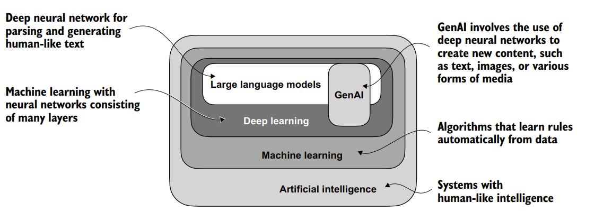
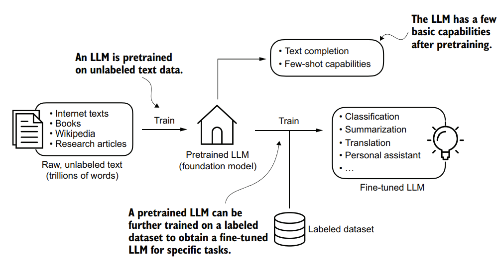
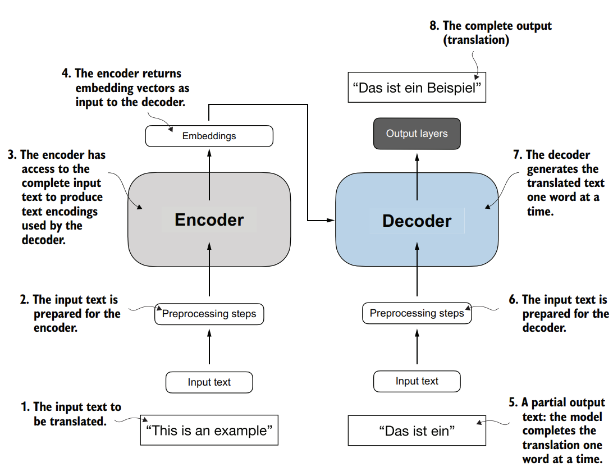
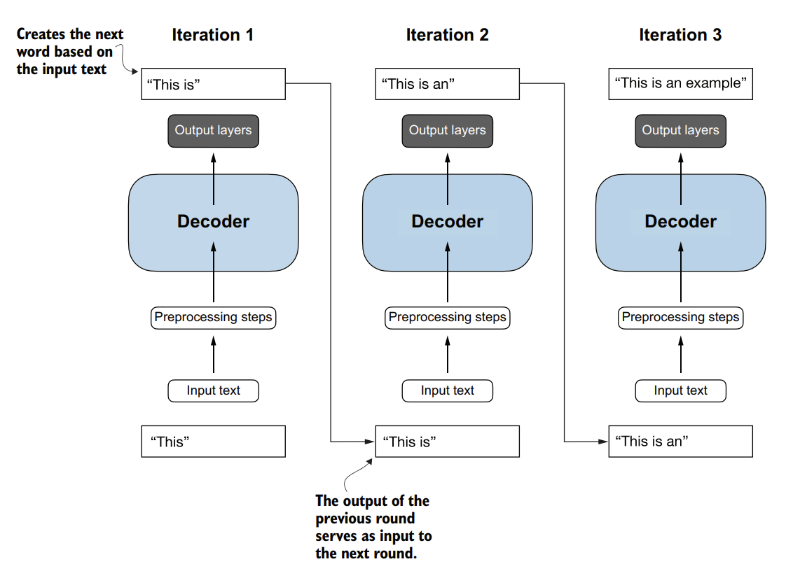

# Chapter 1: Understanding Large Language Models

> 📝 **Note:** This is a personal summary of Chapter 1, written in my own words for better understanding.

## 1.1 What is an LLM?

A Large Language Model (LLM) is a deep neural network trained on massive amounts of text to understand and generate human-like language. It learns by predicting the next word in a sentence, allowing it to recognize patterns, grammar, and context. Modern LLMs such as GPT and Llama can perform a wide variety of NLP tasks using a single model.

---

## 1.2 Applications of LLMs

LLMs are used in many real-world applications, including:

* Text generation
* Machine translation
* Text summarization
* Question answering
* Chatbots and virtual assistants
* Code generation
* Sentiment analysis

Their flexibility makes them useful across many industries.

---

## 1.3 Stages of Building and Using LLMs

Developing an LLM generally involves two stages:

1. **Pretraining** – The model learns language from large amounts of unlabeled text.
2. **Fine-Tuning** – The pretrained model is adapted for specific tasks using smaller labeled datasets.

This approach allows one foundation model to solve many downstream tasks.

---

## 1.4 Introducing the Transformer Architecture

Most modern LLMs are based on the Transformer architecture. It uses a mechanism called **Self-Attention** to understand relationships between words in a sentence. GPT models use only the decoder part of the Transformer, making them efficient for text generation.

---

## 1.5 Utilizing Large Datasets

LLMs are trained on enormous datasets collected from books, websites, Wikipedia, research papers, and other public sources. Large and diverse datasets help the model learn grammar, facts, reasoning patterns, and general language understanding.

---

## 1.6 A Closer Look at the GPT Architecture

GPT stands for **Generative Pre-trained Transformer**. It generates text one token at a time by predicting the next word based on previous words. Although trained only for next-word prediction, GPT can also perform tasks like translation, summarization, coding, and question answering.

---

## 1.7 Building a Large Language Model

Building an LLM involves several key steps:

* Data Preparation
* Tokenization
* Attention Mechanism
* Model Architecture
* Pretraining
* Model Evaluation
* Loading Pretrained Weights
* Fine-Tuning
* Deployment

Each chapter of this repository will implement these components step by step using PyTorch.

---

## Key Takeaways

* LLMs are deep learning models trained on massive text datasets.
* Transformers are the foundation of modern language models.
* GPT uses a decoder-only architecture for text generation.
* Training consists of pretraining followed by fine-tuning.
* Large datasets and self-attention are the key factors behind LLM performance.

## 💭 My Thoughts

### What clicked for me
- LLM basically next token predict karta hai — itna simple idea,
  itna powerful output. Yeh samajh aaya toh sab kuch settle ho gaya
- Pretraining → Fine-tuning pipeline clear ho gaya. Pehle lagta tha
  fine-tuning matlab naya model, actually sirf direction change hoti hai

### What surprised me
- Scale itna matter karta hai — architecture nahi badla, sirf data
  aur parameters badhaye, performance jump kar gaya
- GPT-2 aur GPT-3 ka architecture almost same hai — sirf size different

### What I still don't fully get
- Exactly kaise emergent abilities aati hain scale ke saath
- In-context learning kyun kaam karta hai theoretically

### Real world connection
- Maine CalSnap mein Claude Vision API use ki thi — tab sirf output
  dekha tha. Ab samajh aa raha hai andar kya ho raha hoga
- Karpathy ka Zero to Hero karke aaya hoon — usne character-level
  predict kiya tha, yeh usi ka large scale version hai essentially

---

## 🔗 Resources I Found Helpful
- [Attention Is All You Need](https://arxiv.org/abs/1706.03762)
- [Andrej Karpathy — Neural Networks Zero to Hero](https://youtu.be/kCc8FmEb1nY)
- [Raschka's Book GitHub](https://github.com/rasbt/LLMs-from-scratch)